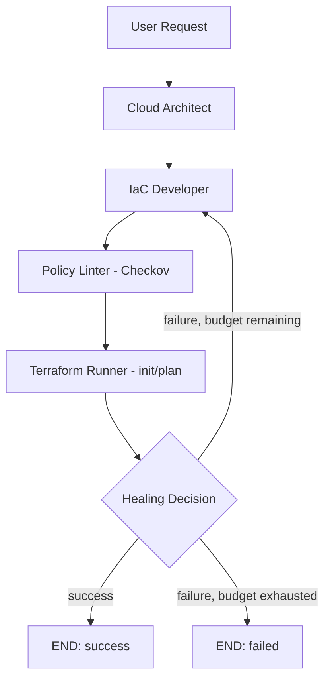

# Cloud Pilot

Cloud Pilot is an AI-powered, provisioning-time Infrastructure-as-Code platform for
Google Cloud Platform. You describe what you need in plain English; Cloud Pilot
architects the required GCP resources, generates secure Terraform, retrieves relevant
templates via RAG, validates the plan with `terraform plan` and Checkov, and
automatically repairs the configuration (bounded to 2 healing attempts) before
returning a final result through an API and a React dashboard.

Cloud Pilot is **provisioning-time autonomous only**. It does not implement runtime
drift detection, autonomous scaling, continuous infrastructure repair, or automatic
production deployment.

---

## 1. Architecture



The **Architect runs exactly once**. On failure (either `terraform plan` failing or
Checkov finding policy violations), the graph loops back to the **IaC Developer**,
which is given the previous errors/violations so it repairs the existing
configuration rather than generating something unrelated. Healing is capped at
`MAX_HEAL_ATTEMPTS` (default 2) - the graph can never loop indefinitely.

## 2. Agent responsibilities

| Agent | Responsibility |
|---|---|
| **Cloud Architect** | Reads the request + constraints + (optional) application RAG context and produces structured `ResourceSpec` objects. Never writes Terraform. Vertex AI/Gemini-powered, with a deterministic offline mock fallback. Runs exactly once per run - never re-invoked during healing. |
| **IaC Developer** | **LLM-primary.** Given the `ResourceSpec`s, constraints, application RAG context, retrieved infra templates, and - during healing - the previous Terraform files plus the specific Checkov/plan failures, it asks the LLM (real Vertex AI/Gemini, or the offline Mock LLM when Vertex isn't configured) to return structured JSON for `main.tf`/`variables.tf`/`providers.tf`/`terraform.tfvars.example`. The output is structurally validated (balanced braces, expected resource blocks present, every `var.X` reference declared, every variable defaulted); if the LLM call fails or the output doesn't validate, generation falls back to a deterministic, secure-by-default generator. **Every Terraform bundle records exactly how it was produced** - see [Terraform generation provenance](#terraform-generation-provenance) below. |
| **Policy Linter** | Runs Checkov against the workspace; normalizes results into `ComplianceViolation`s. If Checkov is unavailable or crashes, a small built-in fallback rule set runs instead - see [Checkov vs. fallback semantics](#checkov-vs-fallback-semantics). |
| **Terraform Runner** | Runs real `terraform init`/`plan` via `subprocess` with argument arrays (never a shell string) and timeouts when the `terraform` binary is present; otherwise uses a clearly-labeled local mock validator (or reports "unavailable") - see [Terraform execution modes](#terraform-execution-modes). |

### Terraform generation provenance

Every generated Terraform bundle is tagged with exactly one of:

| `terraform_generation_method` | Meaning |
|---|---|
| `vertex_llm` | Real Vertex AI/Gemini generated and it passed structural validation. |
| `mock_llm` | Vertex AI isn't configured; the offline Mock LLM (a genuine stand-in for the LLM step, not the same code path as the fallback below) generated it. |
| `deterministic_fallback` | The LLM step (real or mock) failed, returned malformed JSON, or produced HCL that failed structural validation, so the deterministic, secure-by-default generator (`app/terraform/generator.py`) produced it instead. |

This is surfaced in the API (`terraform_generation_method` / `terraform_generation_notes` on
`GET /runs/{run_id}`) and shown as a badge in the frontend's Terraform panel. Cloud Pilot never
reports `vertex_llm` or `mock_llm` when the deterministic fallback actually ran.

## 3. RAG architecture

Two Chroma collections:

- **`infra_templates`** - curated, secure Terraform examples for GCS, Cloud SQL, and
  Compute Engine (seeded from `Backend/infra_templates/`), retrieved by the IaC
  Developer based on the Architect's resource types, with metadata (`resource_type`,
  `provider`, `service`, `security_notes`, `source_file`). The retrieved template
  content itself is included in the IaC Developer's prompt, not just used as a
  presence check.
- **`app_code`** - optional. If you pass `application_source` (a path to your
  application's source tree) when creating a run, Cloud Pilot walks the tree,
  ignoring `.git`, `node_modules`, `.venv`/`venv`, `__pycache__`, `dist`, `build`,
  binaries, and anything that looks like a secret or credential (`.env*`, files with
  `credentials`/`secret`/`service-account` in the name, `.pem`/`.key` files -
  regardless of extension, not just by directory). Python files are chunked by
  top-level function/class via `ast`; JS/TS/JSX/TSX files with a boundary-detection
  heuristic. Every chunk carries structured metadata (`source_file`, `language`,
  `chunk_type`, `symbol`, line range) - this is genuine retrieval-augmented context,
  not raw text concatenation. The retrieved chunks and a derived summary (frameworks,
  database/storage signals, endpoint files) are passed into **both** the Architect's
  and the IaC Developer's prompts.

If `sentence-transformers` or `chromadb` aren't available/loadable, Cloud Pilot
transparently falls back to a deterministic hashing embedder and an in-memory
vector store, so RAG degrades gracefully instead of crashing the pipeline.

## 4. Terraform workflow & healing loop

Every run gets an **isolated workspace** at
`Backend/workspace/tf-run-<timestamp>-<run_id>/`, never reused between runs. Path
traversal and unexpected filenames are rejected.

Validation requires `terraform init` **and** `terraform plan` to both succeed. If
either fails, or Checkov finds violations, and the healing budget isn't exhausted,
the IaC Developer is invoked again with the specific errors/violations **and the
previous Terraform files** (so it repairs the existing configuration instead of
generating something unrelated), then Policy Linter and Terraform Runner re-run.
This can happen a maximum of `MAX_HEAL_ATTEMPTS` times (default 2) - the Architect is
never re-invoked during healing. Every attempt is recorded in `heal_history`.

Every Terraform variable is guaranteed to have a `default` (the deterministic
generator sets sensible demo placeholders; a post-processing safety net,
`ensure_terraform_files_are_plan_safe`, patches any variable an LLM forgets to
default) - since Terraform always runs with `-input=false`, a required variable
with no default would otherwise make `terraform plan` fail outright rather than
produce a useful, healable error.

`terraform apply` is **never** run automatically. It's implemented but gated behind
`SENTINEL_TF_ALLOW_APPLY=1` and a prior successful plan, and is not wired to any API
route - it's available only for deliberate CLI/local use.

### Terraform execution modes

`terraform_plan.mode` (and each command result's `mode`) is always one of:

| Mode | When | Meaning |
|---|---|---|
| `real` | `terraform` binary found on PATH | A real `terraform init`/`plan` ran via subprocess. |
| `mock` | `terraform` binary missing, `SENTINEL_ALLOW_MOCK_TERRAFORM=1` (default) | A local static validator (`app/terraform/mock_runner.py`) checked brace balance, provider/resource presence, and that every referenced variable is declared and defaulted. It does **not** contact GCP and is never presented as a real plan - its stdout says so explicitly, and its findings can still drive the healing loop. |
| `unavailable` | `terraform` binary missing, `SENTINEL_ALLOW_MOCK_TERRAFORM=0` | Validation was not performed at all; `success` is `False` with a structured error, never silently treated as passing. |

### Checkov vs. fallback semantics

`policy_results.status` is always one of:

| Status | Meaning |
|---|---|
| `checkov_ran` | Checkov actually executed. |
| `checkov_unavailable_fallback_used` | Checkov isn't installed - the fallback rule set ran instead. This is an **expected, non-crash** condition: `crashed` is `False`, and `success` reflects the fallback's own findings. |
| `checkov_crashed_fallback_used` | Checkov was invoked but errored (timeout, unparseable output, etc); the fallback rule set still ran and its findings are trustworthy - `crashed` stays `False` here too. |
| `fallback_crashed` | The fallback validator itself errored. `crashed` is `True` and `success` is `False`. |

`policy_results.status_message` gives a plain-language sentence, e.g. *"Checkov is not
installed - fallback policy validator passed (0 finding(s))."* Cloud Pilot never says
"Checkov passed" when Checkov did not actually run.

## 5. API endpoints

| Method | Path | Description |
|---|---|---|
| GET | `/health` | Liveness check |
| POST | `/runs` | Start a new pipeline run. Body: `{"request": "...", "constraints": "...", "application_source": "/optional/path"}`. Returns `{"run_id": "...", "status": "queued"}` immediately; the pipeline runs in the background. |
| GET | `/runs` | List recent runs |
| GET | `/runs/{run_id}` | Full run detail (resources, Terraform files, policy results, plan output, heal history, errors) |
| GET | `/runs/{run_id}/status` | Lightweight status/current-node poll |
| GET | `/runs/{run_id}/logs` | Structured per-node log events for the run |

## 6. Frontend

A React + TypeScript + Vite + Tailwind dashboard (`Frontend/`) with:

- **Dashboard** - start a new run, see the pipeline stages, browse recent runs.
- **Run details** - request/constraints, Architect's resource specs, a tabbed
  Terraform file viewer, Checkov results, `terraform plan` stdout/stderr, and the
  healing timeline.

All backend calls go through `Frontend/src/services/api.ts`, configured via
`VITE_API_BASE_URL` (defaults to `http://localhost:8000`).

## 7. Local setup

### Prerequisites
- Python 3.12+
- Node.js 20+
- [Terraform](https://developer.hashicorp.com/terraform/downloads) (for real `init`/`plan` execution - the pipeline still runs and reports a clear structured error without it)
- [Checkov](https://www.checkov.io/) (installed via `requirements.txt`; if unavailable, a fallback validator runs)
- (Optional) A GCP project + Vertex AI access for real Gemini calls - **not required**; without it, Cloud Pilot uses a deterministic offline mock LLM so the whole pipeline is fully runnable and testable with zero external services.

### Backend

```bash
cd Backend
python3 -m venv .venv
source .venv/bin/activate          # Windows: .venv\Scripts\activate
pip install -r requirements.txt
cp .env.example .env                # edit as needed
uvicorn app.main:app --reload --port 8000
```

### Frontend

```bash
cd Frontend
npm install
cp .env.example .env
npm run dev                         # http://localhost:5173
```

### Docker Compose (Backend + Frontend + PostgreSQL)

```bash
docker compose up --build
```

- Backend: http://localhost:8000
- Frontend: http://localhost:5173
- PostgreSQL: localhost:5432 (user/pass/db: `cloudpilot`)

### CLI (local debugging without the API/frontend)

```bash
cd Backend
python -m app.cli "Create infrastructure for a web application that needs PostgreSQL, object storage, and a compute instance."
```

## 8. Environment variables

See `Backend/.env.example` and `Frontend/.env.example` for the full list. Key ones:

| Variable | Purpose |
|---|---|
| `GOOGLE_CLOUD_PROJECT` / `GOOGLE_CLOUD_LOCATION` | Vertex AI project/region. If unset, the offline mock LLM is used automatically. |
| `SENTINEL_TF_ALLOW_APPLY` | Must be `1` to ever allow `terraform apply` (CLI-only, never via API). Default `0`. |
| `DATABASE_URL` | PostgreSQL connection string. If unset/unreachable, falls back to local SQLite at `Backend/workspace/cloud_pilot.db`. |
| `CHROMA_PERSIST_DIRECTORY` | Where the Chroma vector store persists on disk. |
| `MAX_HEAL_ATTEMPTS` | Healing budget (default `2`). |
| `SENTINEL_ALLOW_MOCK_TERRAFORM` | Default `1`. When the `terraform` binary is missing, run the clearly-labeled local mock validator instead of skipping validation. Set to `0` to instead report Terraform validation as `unavailable`. |
| `VITE_API_BASE_URL` | Frontend -> backend base URL. |

## 9. GCP authentication (for real Vertex AI / Gemini calls)

1. `gcloud auth application-default login` (or mount a service account key and set
   `GOOGLE_APPLICATION_CREDENTIALS`).
2. Set `GOOGLE_CLOUD_PROJECT` and `GOOGLE_CLOUD_LOCATION` in `.env`.
3. Ensure the Vertex AI API is enabled on the project.

Without this, Cloud Pilot automatically and transparently falls back to a
deterministic mock LLM - nothing crashes, and the full pipeline (including healing)
remains exercisable end-to-end.

## 10. Running tests

```bash
cd Backend
pip install -r requirements.txt
pytest -v
```

Tests mock all external services (LLM, vector store, embeddings, Checkov/Terraform
binaries where relevant) and never require real GCP infrastructure. Coverage
includes state validation, the Architect (valid/malformed/missing-field LLM output),
the IaC Developer's LLM-primary/deterministic-fallback path (valid LLM output, LLM
errors, malformed JSON, structurally-invalid HCL, offline Mock LLM output, healing
prompts including previous files/errors), RAG ingestion/retrieval/metadata
filtering/secret-file exclusion, Terraform workspace/subprocess/timeout handling,
the mock Terraform validator and real/mock/unavailable mode selection, Checkov
parsing and the corrected unavailable-vs-crashed fallback semantics, the full
healing loop (first-try success, heal-once success, exhausted-budget failure, and a
guarantee the Architect is never re-run during healing), and the API contract.

> **Note on this repository's build environment:** this project was generated in a
> sandbox with no outbound network access, so `pip install` / `npm install` and a
> live `pytest`/`terraform`/`checkov` run could not be executed here. Every Python
> file was syntax-validated (`ast.parse`) and manually reviewed; run the commands
> above in your own environment to install dependencies and execute the full suite.

## 11. Running Terraform directly (advanced/debugging)

Each run's workspace is a normal Terraform directory:

```bash
cd Backend/workspace/tf-run-<timestamp>-<run_id>
terraform init
terraform plan
# terraform apply is NOT run by Cloud Pilot automatically - review the plan yourself first.
```

## 12. Safety limitations (by design)

- `terraform apply` is never triggered automatically or via any API route.
- Subprocess calls always use argument arrays (never shell strings) and always have
  a timeout.
- Path traversal / unexpected filenames are rejected when writing Terraform files.
- Only a fixed, supported resource-type list is generated
  (`google_storage_bucket`, `google_sql_database_instance`,
  `google_compute_instance`) - the system does not claim to support every GCP
  service, and unsupported Architect output is flagged, not silently dropped.
- Checkov's fallback validator is a small, clearly-labeled rule set - it is never
  presented as equivalent to a real Checkov run.

## 13. Known limitations

- Terraform generation covers three resource types; extending coverage means adding
  a new branch to `app/terraform/generator.py` plus a new secure template under
  `Backend/infra_templates/`, and extending the `_ALLOWED_RESOURCE_BLOCK_TYPES` set
  in `validate_terraform_files`.
- The offline Mock LLM's heuristics (both the Architect's keyword matching and the
  IaC Developer's structured-JSON generation) are simple stand-ins - real Vertex
  AI/Gemini produces materially better resource selection and HCL for ambiguous or
  unusual requests.
- The mock Terraform validator (used when the `terraform` binary isn't installed) only
  performs static structural checks (brace balance, provider/resource presence,
  variable declaration/default consistency) - it cannot catch the wide range of
  errors a real `terraform plan` would (invalid attribute values, provider-specific
  constraints, etc), and never contacts GCP.
- No remote Terraform state backend is configured (local state per workspace only).
- No cost estimation/guardrails.
- The JS/TS chunker is regex-boundary-based, not a full tree-sitter grammar.

## 14. Explicitly NOT implemented (by design, per project scope)

Runtime drift detection, Cloud Asset Inventory synchronization, autonomous runtime
scaling, monitoring-driven infrastructure changes, a continuous operator agent,
automatic production deployment, remote GCS Terraform state, cost
optimization/guardrails.

## 15. Future improvements

- Broaden the supported GCP resource catalog (GKE, Pub/Sub, Cloud Run, IAM bindings).
- Real tree-sitter-based chunking for the application RAG collection.
- Streaming pipeline progress over WebSockets instead of polling.
- Pluggable remote Terraform state backends.
- Cost estimation via Infracost integration.

## 16. Project structure

```text
Cloud-Pilot/
├── Backend/
│   ├── app/
│   │   ├── main.py, config.py, cli.py, persistence.py
│   │   ├── api/            # FastAPI routes + schemas
│   │   ├── graph/          # LangGraph state, graph wiring, routing
│   │   ├── agents/         # Architect, IaC Developer, Policy Linter, Terraform Runner
│   │   ├── rag/            # Chroma store, embeddings, chunker, ingestion
│   │   ├── terraform/      # generator, workspace, subprocess runner
│   │   ├── llm/            # Vertex/Gemini client + offline mock fallback
│   │   ├── models/         # Shared Pydantic schemas
│   │   └── utils/          # Structured logging
│   ├── infra_templates/    # Seed Terraform examples for RAG (gcs, cloud_sql, compute_engine)
│   ├── workspace/          # Per-run isolated Terraform workspaces (gitignored contents)
│   ├── tests/               # pytest suite
│   ├── requirements.txt, Dockerfile, .env.example
│
├── Frontend/
│   ├── src/
│   │   ├── components/, pages/, hooks/, services/, types/
│   │   └── App.tsx, main.tsx, index.css
│   ├── package.json, vite.config.ts, tailwind.config.js, Dockerfile, .env.example
│
├── docker-compose.yml
├── README.md
└── .gitignore
```
